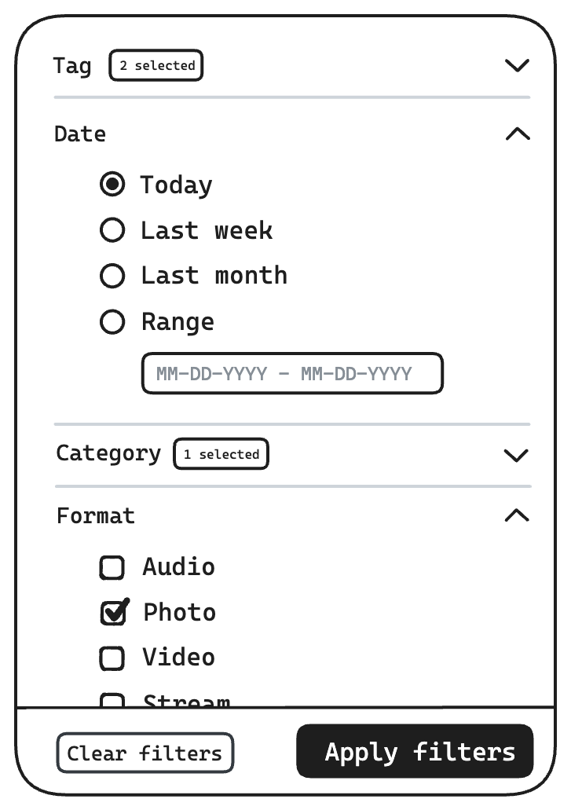
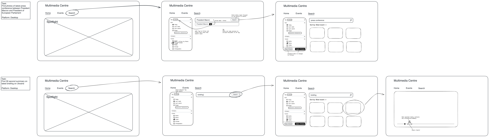

View [Multimedia Centre concept](https://excalidraw.com/#json=4WlobPNG4meVHVc7IDCRH,4v_woZHgknrwTYQW0z3Q_Q)

## What contributes to digital sustainability?

- Filters (**hard boundary**)
- Sorting relevant results first (**soft boundary**)
- Skip unnecessary pages
- Annotate video highlights

**Note:** Faster task completion does not necessarily represent digital sustainability, because it may require more upfront resources

### What can we learn from top tasks?

- Most tasks involve _recent_ information - an opportunity to apply default date filter
- Audio and photos are being copied - highest quality needs to be _available_ but probably doesn't need to be served by search, provide links for CDN?

### What is currently not sustainable?

- ~~Encourages reproducing media rather than providing shared URLs (audio/video has embed)~~
- Filters apply _on click_ (multiplying filtered searches)
- Extra navigation required to get to Topics page + search on Topics link
- Unbound initial filter (700k+ photos) - users know what media type they're needing, suggest filtering beforehand

## Filters

### Problem

The existing filters UX has a large impact on the sustainability of the European Parliament (EP) site. Two aspects of the current filters that stand out are:

- Filters are applied for each _interaction_ rather than as a _single action_
- When viewing multimedia pages, the highlights and initial results are unfiltered and unbound (hundreds of thousands of results)

Both of these issues result in wasted resources and slowed down task completion.

### Solution

- Submit all changes to filters at once/search query
- Set reasonable default date, considering most top tasks involve recent information

**Note**: mobile is not shown, but I'm picturing it functioning similarly to the autocompleted filter options when initally searching and as full screen when updating filters after a search

## Navigation

### Problem

The existing navigation slows down users looking for specific information in several ways, mainly:

- Highlights page is shown for each media format before being able to navigate to search/filters
- Navigating to different media formats, which are essentially filters, do not persist other filter selections

Both of these issues also result in wasted resources and slowed down task completion.

### Solution

- Move highlights to Home page
- Consolidate links that act as filters into Search page

  
Extra notes from the process

  
  # Multimedia center

The **most used** filters are:

- **Topics** (almost always used),
- **Dates** (almost always used),
- **Streaming/Videos/Photos** (often used)
- **Category** (multi-selection is necessary),
- **Tags** (multi-selection is necessary),

These are **representative tasks (top tasks)** that users perform on Multimedia Center:

- Find the photos from the latest press conference between President Macron and President of the European Parliament
- Find a 30-sec summary video on the latest briefing on the war in Ukraine
- Follow the ongoing plenary live
- Find a series of interview audio snippets for a political TV program or a podcast
- Get high quality photos for a feature article in a newspaper
- Find a relevant series of photos on the topic of climate change in relation to European Parliament

## OKRs

- **Key result 1**: Reduce the failure rate for navigation by 50% (internal/external users).
- **Key result 2**: Reduce the failure rate for search by 50% (internal/external users).

## Constraints

- Should have **high top tasks completion rates**,
- Should have a **minimal environmental impact**,
- Should **improve the speed of publishing**,

## What contributes to digital sustainability?

- Filters (**hard boundary**)
- Sorting relevant results first (**soft boundary**)
- Skip unnecessary pages
- Annotate video highlights

**Note:** Faster task completion does not necessarily represent digital sustainability, because it may require more upfront resources

### What can we learn from top tasks?

- Most tasks involve _recent_ information - an opportunity to apply default date filter
- Audio and photos are being copied - highest quality needs to be _available_ but probably doesn't need to be served by search, provide links for CDN?

